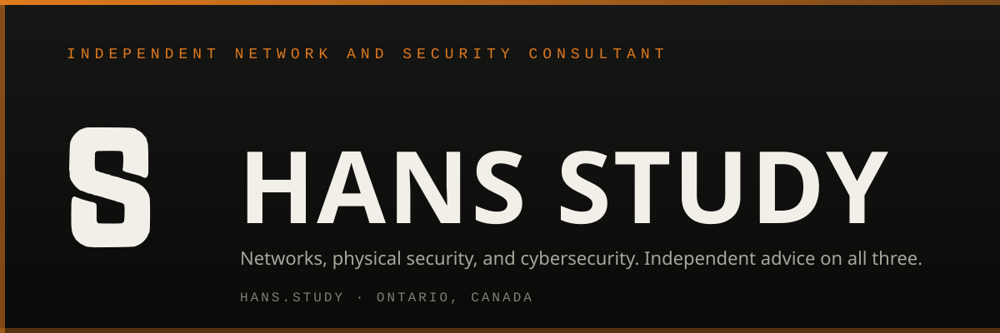

  

# Hans Study, CISSP

Hans Study is an independent network and security consultant in Ontario, Canada. The practice covers enterprise networks and IT/OT, Windows and network hardening, and cyber security readiness for defense suppliers under CMMC and Canada's CPCSC, with a long-standing specialty in physical security systems such as Genetec Security Center.

Independent means no hardware or software resale and no vendor commissions. The aim is to leave clients and practitioners able to run what they own.

Hans is the author of The Study Guide series, including the free *Study Guide to CPCSC Readiness* (CC BY-ND 4.0, DOI [10.5281/zenodo.23145960](https://doi.org/10.5281/zenodo.23145960)).

  
  
  
  
  
  
  

## At a glance

| | |
|---|---|
| Role | Independent network and security consultant |
| Credential | CISSP |
| Based | Ontario, Canada. Work across Canada and the United States |
| Books | The Study Guide series (CCTV and access control; network and system hardening; CPCSC readiness) |
| Website | [hans.study](https://hans.study) |
| ORCID | [0009-0000-5322-5033](https://orcid.org/0009-0000-5322-5033) |
| Wikidata | [Q141043781](https://www.wikidata.org/wiki/Q141043781) |
| CPCSC guide | [hans.study/cpcsc_book](https://hans.study/cpcsc_book/) · DOI [10.5281/zenodo.23145960](https://doi.org/10.5281/zenodo.23145960) · [Wikidata Q141648473](https://www.wikidata.org/wiki/Q141648473) |

## About

Fifteen years of field work across the public sector, defense, public safety, and critical infrastructure. The practice is boutique: enterprise networks, OT and ICS, and the infrastructure underneath them. Hardening and tuning where the stakes are high and the margin for error is small.

Day-to-day stacks are Microsoft Windows (server and workstation), Cisco, and Aruba. Genetec Security Center and other VMS platforms show up when the job needs them, along with Axis, Bosch, Milestone, Avigilon, C-CURE, Fortinet, Palo Alto, Juniper, and Alcatel-Lucent OmniSwitch.

## Repositories

Public GitHub work lives here. Browser tools stay on the site.

| Repository | What it is | Licence |
|---|---|---|
| [CPCSC](https://github.com/hansstudy/CPCSC) | CPCSC and ITSP.10.171 hub: all 98 controls in plain language, Level 1 checklist, read-only Windows audit scripts, templates | Scripts MIT; docs and data CC BY 4.0 |
| [Windows hardening scripts](https://github.com/hansstudy/windows-hardening-scripts) | Standalone PowerShell baselines: DISA STIG, CIS L1, CCCS/NSA/CISA, CMMC/CPCSC readiness, Genetec, kiosk | Source-available (Hans Study licence) |
| [PortProof](https://github.com/hansstudy/portproof) | Proves a declared firewall path list is open; pass/fail matrix and HTML, CSV, and JSON reports | Apache-2.0 |
| [cisco-switch-config](https://github.com/hansstudy/cisco-switch-config) | Offline Cisco IOS/IOS-XE config audit (121 checks) and hardened baselines, as a Claude skill | Apache-2.0 |

Browser tools (workstation configurator, switch config audit, CIDR and conductor calculators, policy builder) are at [hans.study/tools](https://hans.study/tools/).

Each repository's own LICENSE governs it. The S monogram and the Hans Study wordmark are not covered by any code licence.

## Topics

- Network architecture and hardening (Cisco, Aruba, Juniper, ALE OmniSwitch)
- Microsoft Windows hardening (Server and Workstation, Active Directory, Defender)
- Canadian Program for Cyber Security Certification (CPCSC), ITSP.10.171, and ITSG-33
- CMMC, NIST SP 800-171, and ISO 27001 readiness
- OT and ICS security
- Physical security systems (CCTV, access control, Genetec Security Center) when the engagement needs them
- IT and physical security convergence
- Structured cabling and installation quality
- Mentorship for practitioners and integrators who want to own their stack

## Books

Hans is the author of The Study Guide series, a practitioner-focused set for networks, physical security, and the problems that sit between disciplines.

- **The Study Guide to CPCSC Readiness**. Free PDF. CC BY-ND 4.0. [hans.study/cpcsc_book](https://hans.study/cpcsc_book/) (site copy) · [Zenodo v1.3.2](https://zenodo.org/records/23171055) · DOI [10.5281/zenodo.23145960](https://doi.org/10.5281/zenodo.23145960) · [Internet Archive](https://archive.org/details/the-study-guide-to-cpcsc-readiness-hans-study)
- **The Study Guide to Network and System Hardening: A Field Reference for Systems and Security Integrators**. Paperback and Kindle. [Amazon](https://a.co/d/06TeQhgd)
- **The Study Guide to CCTV and Access Control Systems: A Field Reference for Working Integrators and Security Technicians**. Paperback and Kindle. [Amazon](https://a.co/d/0g6e3Hbp)

Author page: [amazon.com/author/hans-study](https://www.amazon.com/author/hans-study). Review copies, bulk orders, and translations: book@hans.study.

## Podcast

Hans hosts **StudyByt3s**, covering networks, physical security, and cybersecurity. Taking a byte out of how those systems actually work. Bit and byte. Bite-sized.

Listen at [hans.study/studybyt3s/](https://hans.study/studybyt3s/) or search "StudyByt3s" on Apple Podcasts, Spotify, and YouTube.

## Contact and links

- **Website**: [hans.study](https://hans.study)
- **Email**: contact@hans.study
- **ORCID**: [0009-0000-5322-5033](https://orcid.org/0009-0000-5322-5033)
- **Wikidata**: [Q141043781](https://www.wikidata.org/wiki/Q141043781)
- **LinkedIn**: [linkedin.com/in/hans-study](https://linkedin.com/in/hans-study)
- **X**: [x.com/studybyt3s](https://x.com/studybyt3s)
- **YouTube**: [youtube.com/@studybyt3s](https://youtube.com/@studybyt3s)
- **Instagram**: [instagram.com/studybyt3s](https://instagram.com/studybyt3s)
- **GitHub**: [github.com/hansstudy](https://github.com/hansstudy)
- **Books**: [hans.study/books](https://hans.study/books/)
- **Amazon Author**: [amazon.com/author/hans-study](https://www.amazon.com/author/hans-study)

